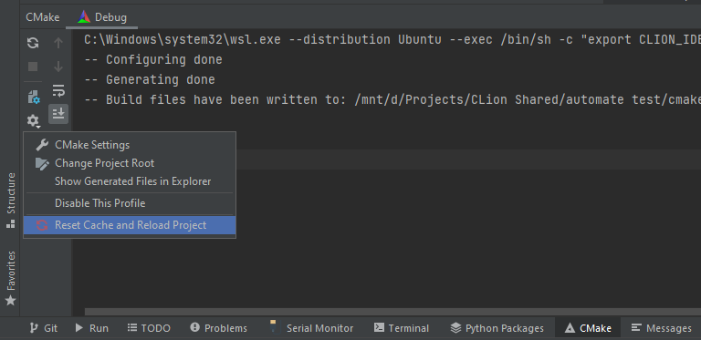
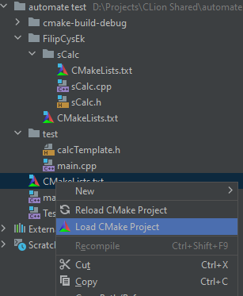

# FAQ, rozwiązywanie podstawowych problemów

## Problemy z narzędziami deweloperskimi

### Próbuję uruchomić z konsoli mój program, ale nie działa

Sprawdź z jakiego narzędzia deweloperskiego korzystasz. Jeżeli jesteś na windowsie i korzystasz z:
- VisualStudio - odpal cmd i powinno działać
- cygwin - odpal konsolę cygwina i z jej poziomu uruchom program
- mingw - odpal konsolę mingw i z jej poziomu uruchom program, jeżeli nie możesz jej znaleźć popatrz [tutaj](https://stackoverflow.com/questions/14430944/i-cant-find-my-mingw-shell-after-installing-with-gui-installer/18094371)
- WSL - odpal konsolę ubuntu


### Mam cygwina i nie wykrywa kompilatora

1. Uruchom instalator cygwina
2. Przeklikaj dalej do tabeli, gdzie można wybierać pakiety do instalacji
3. Z rozwijanego menu u góry wybierz `Full` zamiast `Pending`
4. Znajdź i zaznacz do instalacji:
   - gcc
   - g++
   - gdb


## Problemy z CMake

### Nie wykrywa mi targetu (nie ma na liście rozwijanej jednego outputu)

**Czy CMake został załadowany poprawnie (w zakładce `CMake` na dole nie ma błędów)?**

**Próbowałeś załadować ponownie plik CMake?**


Ewentualnie załadować ponownie z resetem cache?



**Masz wybrany poprawny bazowy plik CMake?**




**W bazowym pliku CMake dodajesz podkatalog z kolejnym plikiem CMake?**

Bzowy plik CMake - plik, który jest ładowany jako pierwszy, powinien to być plik, który znajduje się najwyżej w naszym projekcie

```cmake
add_subdirectory(nazwa_katalogu)
# Jeżeli w nazwie katalogu występuje spacja
add_subdirectory("nazwa katalogu")
```


## Problemy z git

### Dodałem niepotrzebne pliki i nie wiem jak je usunąć

Odpal konsolę, przejdź do głównego katalogu Twojego projektu i użyj komendy:

```console
git rm --cached -r plik/folder, który chcesz usunąć
```

Przykładowo chcemy usunąć plik `Test.txt`.

```console
git rm --cached -r Test.txt
```

## CLion

### Skróty klawiszowe

Skróty klawiszowe można znaleźć [tutaj](https://www.jetbrains.com/help/clion/mastering-keyboard-shortcuts.html) oraz 
[tutaj w wersji pdf](https://resources.jetbrains.com/storage/products/clion/docs/CLion_ReferenceCard.pdf)

Kilka najważniejszych i najczęściej używanych:
- `ctrl + alt + L` - refaktoryzacja kodu (formatowanie, aby był poprawnie i ładnie i czytelnie)
- `alt + enter` - jeżeli cokolwiek jest podkreślone na jakiś kolor, bądź ma żółte tło, to tam znajdziemy szybkie akcje, co można z tym zrobić, albo jak to naprawić (nie zawsze są wszystkie rozwiązania)
- `ctrl + p` - pokazywanie parametrów. Jeżeli wywołujemy jakąś funkcję, a nie pamiętamy jej parametrów, to będąc w nawiasie klikamy te przyciski i pokazują się nam parametry, jakie ona przyjmuje
- `ctrl + q` - pokazywanie dokumentacji, musimy znajdować się na nazwie funkcji, aby zadziałało to poprawnie
- `tab` - jeżeli piszemy jakąś nazwę, bądź typ zmiennej, to po kliknięciu `tab` dokończy nazwę za nas biorąc pierwszą z podpowiedzi
- `ctrl + spacja` - wyświetlanie sugestii
- `ctrl + lpm` - przechodzenie do deklaracji, bądź miejsca użycia zmiennej, funkcji, bądź innego elementu
