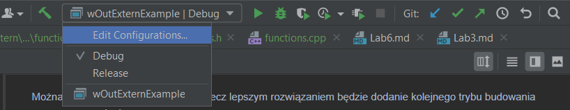

# Laboratorium 12 (17.01.2022/24.01.2022)


## 1. Typ wyliczeniowy

Tworzymy aplikację, ktora ma kilka trybów działania np:

- pobieranie danych
- wypisywanie
- analizowani
- krzyczenie na użytkownika

Chcemy zapisać, w jakim aktualnie trybie ona działa, jakiego typu zmiennej byś użył?

`int` może `short`, albo klasa z kilkoma `bool`

&nbsp;

C++ przychodzi do nas z genialniejszym rozwiązaniem, typami wyliczeniowymi. Typ wyliczeniowy to taka zmienna, która posiada zadeklarowane swoje wartości, i tylko je można do niej przypisać.

```c++
enum nazwa_typu {
    //wartości
};
```

&nbsp;

Zadeklarujmy typ wyliczeniowy dla naszego przykładu.

```c++
enum appMode {
    DOWNLOADING_DATA,
    PRINTING_DATA,
    ANALYSING_DATA,
    SHOUT_AT_USER
};
```

Jak zapewne zauważyłeś, wszystkie „wartości” są pisane wielkimi literami. Jest tak robione, aby łatwo można było odróżnić nazwy zmiennych, bądź funkcji od „wartości” typów wyliczeniowych.

&nbsp;

Zadeklarujmy teraz zmienną z typem wyliczeniowym i przypiszmy mu wartość.

```c++
enum appMode {
    DOWNLOADING_DATA,
    PRINTING_DATA,
    ANALYSING_DATA,
    SHOUT_AT_USER
};

int main() {
    appMode actualMode = DOWNLOADING_DATA;
    cout << actualMode << endl;
    
    actualMode = PRINTING_DATA;
    cout << actualMode << endl;
    
    actualMode = ANALYSING_DATA;
    cout << actualMode << endl;
}
```

Jak pewnie zauważyłeś „wartościom” typów wyliczeniowych są przypisywane wartości liczbowe, każda kolejna deklaracja posiada zwiększoną o 1 wartość liczbową. Teraz zobacz na kolejny przykład, gdzie nadpisujemy wartości (tak można to robić).

```c++
enum dni {
    PON,
    WT,
    SR = 0,
    CZW = 0,
    PT = 0,
    SO,
    N
};

int main() {
    dni actualDay = PON;
    cout << actualDay << endl;
    
    actualDay = WT;
    cout << actualDay << endl;
    
    actualDay = SR;
    cout << actualDay << endl;
    
    actualDay = CZW;
    cout << actualDay << endl;
    
    actualDay = PT;
    cout << actualDay << endl;
    
    actualDay = SO;
    cout << actualDay << endl;
    
    actualDay = N;
    cout << actualDay << endl;
    
    actualDay = PON;
    dni actualDay1 = WT;
    
    cout << endl << "PON == WT" << endl;
    cout << (actualDay == actualDay1) << endl;
    
    actualDay = PON;
    actualDay1 = SR;
    
    cout << endl << "PON == SR" << endl;
    cout << (actualDay == actualDay1) << endl;
}
```

&nbsp;

&nbsp;

## 2. Debug, release

Tryb debug i release to różne konfiguracje do tworzenia projektu. Programiści zazwyczaj używają trybu debug do debugowania krok po kroku swojego projektu
i wybierają tryb release dla ostatecznej kompilacji.

Tryb debug oznacza, że uruchamiamy aplikację z dołączonym debugerem. Dzięki temu możemy korzystać z pełnego zestawu funkcji debugowania,
które ułatwiają znajdowanie usterek w aplikacji.

Tryb debugowania nie optymalizuje tworzonego pliku binarnego, ponieważ związek między kodem źródłowym a wygenerowanymi instrukcjami jest bardziej złożony. Pozwala to na dokładne ustawienie breakpointów. Konfiguracja debugowania programu jest kompilowana z pełnymi symbolicznymi informacjami debugowania, które pomagają debugerowi określić, gdzie się znajduje w kodzie źródłowym.

Release umożliwia optymalizację i generowanie bez żadnych danych debugowania, dzięki czemu jest w pełni zoptymalizowany. Wiele kodu może zostać całkowicie usuniętych lub przepisanych w trybie release. Wynikowy plik wykonywalny najprawdopodobniej nie będzie pasował do napisanego kodu. Z tego powodu tryb release będzie działał szybciej niż tryb debugowania ze względu na optymalizacje.

&nbsp;

### Zmiana trybu kompilacji

Aby zmienić tryb kompilacji w clion, należy otworzyć ustawienia i przejść do zakładki `CMake`.


Można odrazu zmienić `build type`, lecz lepszym rozwiązaniem będzie dodanie kolejnego trybu budowania poprzez znaczek plusa.


Teraz obok ikony budowania, w rozwijalnym menu mamy do wyboru, w jakim trybie chcemy zbudować nasz program.



&nbsp;

### Zadanie

1. Skompiluj program, który znajduje się [tutaj](Examples/Matrix) w trybie `debug` i `release`. Porównaj czasy wykonywania poszczególnych etapów.

&nbsp;

&nbsp;

## 3. Wielowątkowość

Dotychczas wszystkie tworzone przez nasz aplikacje były jednowątkowe, jedno zadanie było wykonywane w tym samym czasie.
C++ ma wbudowana wielowątkowość i stosunkowo łatwo ją używać, wystarczy załączyć bibliotekę `thread` i przypisać zadanie do wątku.

```c++
#include <iostream>
#include <thread>
#include <chrono>

using namespace std;

void function() {
    cout << "I'm very slow function" << endl;
    this_thread::sleep_for(chrono::seconds(10));
    cout << "Ohhh, this is very hard work" << endl;
}

int main()
{
    //Funkcja wywolana bez wielowątkowości
    function();
    cout << "I try do this in the same time!" << endl;
    
    cout << endl << endl << endl;
    
    //funkcja wywołana w wnowym atku
    thread th(function);
    cout << "I try do this in the same time!" << endl;
    th.join();
    
    cout << "end" <<endl;

    return 0;
}
```

Stworzona została funkcja, która „działa” bardzo powoli (no wiem, że śpi, ale jakoś musimy to symulować), a zaraz pod nią zostało wywołane wypisanie na ekranie. W pierwszym wypadku wykonało się wszystko sekwencyjnie, a w drugim jednocześnie.

- `thread th(function)` - tworzenie i uruchamianie funkcji function w nowym wątku
- `th.join()` - oczekiwanie na zakończenie działania wątku `th`

&nbsp;

### Deklarowanie nowego wątku

Jak zapewne zauważyłeś w przykładzie, deklaracja wątku jako pierwszy argument przyjmuje nazwę funkcji, która ma zostać uruchomiona w nowym wątku. Co, jeżeli nasza funkcja przyjmuje jakieś argumenty? Przekazujemy je jako kolejne argumenty przy tworzeniu wątku:

```c++
void function1(string text, unsigned short times) {
    for(int i = 0; i < times; ++i) {
        cout << i << ". " << text << endl;
    }
}

int main() {
    cout << "The best people ranking:" << endl;
    thread th(function1, "me", 10);
    th.join();
}
```

&nbsp;

### Co z wątkami w klasach?

Używanie metody klasy jako zadania do wykonania w nowym wątku jest nieco bardziej skomplikowane, ponieważ nie wystarczy przekazać tylko nazwy funkcji. Należy przekazać nazwę obiektu, a jako kolejny parametr obiekt, na którym ma być to wywołane:

```c++
#include <iostream>
#include <thread>
#include <chrono>
#include <random>
#include <iomanip>

using namespace std;

class MyClass {
private:
    vector<vector<double>> matrix;
    
    double max;
    
    void findMaxInRow(size_t row) {
        for(auto &cell: matrix[row]) {
            if(max > cell) {
                max = cell;
            }
        }
    }
    
public:
    MyClass(unsigned short columns, unsigned short rows) {
        matrix.resize(rows);
        
        default_random_engine defEngine;
        uniform_real_distribution<double> intDistro(-2000,2000);
        
        for(auto &row: matrix) {
            row.resize(columns);
            
            for(auto &cell: row) {
                cell = intDistro(defEngine);
            }
        }
    }
    
    void printMatrix () {
        for(auto &row: matrix) {
            for(auto &cell: row) {
                cout << setw(10) << cell << "\t";
            }
            cout << endl;
        }
    }
    
    double findMax() {
        max = matrix[0][0];
        vector<thread> thTab;
        
        for(int i = 0; i < matrix.size(); ++i) {
            thTab.emplace_back(&MyClass::findMaxInRow, this, i);
        }
        
        for(int i = 0; i < matrix.size(); ++i) {
            thTab[i].join();
        }
        
        return max;
    }
    
};

int main() {
    MyClass mc(5,10);
    mc.printMatrix();
    
    cout << mc.findMax() << endl;
    return 0;
}
```

Czy powyższa funkcja działa dobrze?

&nbsp;

### Sekcja krytyczna

Są miejsca w kodzie, podczas działania wielowątkowego, które nie mogą się wykonywać równocześnie, ponieważ mogłoby to doprowadzić do błędów. Takie miejsca nazywamy sekcją krytyczną. Aby zabezpieczyć takie miejsce, należy użyć klasy, która działa na zasadzie semafora. `mutex` posiada 2 stany otwarty i zamknięty.

```c++
#include <mutex>

mutex criticalSection;

criticalSection.lock();
// cRITICAL SECTION CODE
criticalSection.unlock();
```

Powyższy kod zabezpiecza sekcję krytyczną przed tym, aby w jej środku mógł być tylko i wyłącznie jeden wątek.

&nbsp;

### Zadanie

1. Popraw przykład z wyszukiwanie maksimum.
2. Uruchom program, który uruchamiałeś przy porównaniu debug i release [(znajduje się tutaj)](Examples/Matrix) i zaimplementuj w nim wielowątkowość.

&nbsp;

&nbsp;

## 4. Współdzielenie zmiennych pomiędzy plikami cpp

```extern```

Jedno ze słów kluczowych oraz specyfikatorów (kwalifikatorów, modyfikatorów) klas pamięci dla deklarowanych obiektów. Oznacza, że deklaracja nie jest deklaracją w sensie fizycznym, a jedynie odwołaniem do deklaracji znajdującej się w innej jednostce kompilacji (module, pliku, bibliotece - przyp. autora). Jednym słowem, jest to sposób na poinformowanie kompilatora, by nie szukał danej zmiennej globalnej w aktualnym pliku. Jednak na tym nie koniec możliwości tego modyfikatora.

! Specyfikatory extern i Static wzajemnie się wykluczają, dlatego nie zaleca się tworzenia deklaracji zawierających obydwa te słowa jednocześnie. Ponadto zabroniona jest inicjalizacja zmiennej zadeklarowanej z użyciem modyfikatora extern !


Jak już zostało wspomniane, jeżeli extern poprzedza deklarację nie zainicjalizowanej zmiennej (globalnej lub lokalnej) albo stałej, oznacza to wówczas, że deklarowany obiekt nie zawiera się w danym pliku, a w innej jednostce kompilacji (może to być inny moduł, nagłówek, biblioteka statyczna lub dynamiczna itp.):


/* ==== plik1.c ===== */
```c++
#include <stdio.h>
#include <stdlib.h>

   int liczba;  /* deklaracja zmiennej globalnej */

   /* ... */

   liczba = 13;

   /* ... */
```


/* ==== plik2.c ===== */
```c++
#include <stdio.h>
#include <stdlib.h>
#include "plik1.h"

   extern int liczba;  /* deklaracja zmiennej globalnej, znajdującej się w pliku 'plik1.c' */

int main (int argc, char** argv)
{
   printf("liczba=%d\n", liczba);  /* → wypisze na wyjściu: liczba=13 */
   return 0;
}
```

[Zobacz przykład](Examples/extern)

[Zobacz przykład bez extern](Examples/withoutExtern)

&nbsp;

Jeżeli specyfikator ten poprzedza deklarację stałej zainicjalizowanej, oznacza to, że taka stała posiada łączność zewnętrzną (więc z kolei extern przed stałą niezainicjalizowaną importuje taką stałą). W odróżnieniu od zmiennych, które można powstrzymać przed eksportowaniem symbolu przez specyfikator Static, stałe globalne wymagają extern, żeby eksportować symbol na zewnątrz.


Wewnątrz funkcji deklaracje ze specyfikatorem extern również wskazują, że pamięć dla deklarowanych obiektów będzie zarezerwowana gdzie indziej. Jeżeli deklaracja obiektu wewnątrz bloku (pętli, funkcji itp. - przyp. autora) nie zawiera specyfikatora extern, wówczas obiekt ten nie ma łączności i jest unikalny w funkcji. W przeciwnym wypadku, gdy w zasięgu otaczającym dany blok obowiązuje zewnętrzna deklaracja tego samego obiektu, wówczas ma on taka samą łączność, jak w deklaracji zewnętrznej i odnosi się do tego samego obiektu:

```c++
/* ===== external.c ===== */
#include <stdio.h>
#include <stdlib.h>

   extern int liczba;   /* zmienna zadeklarowana w innym module */

int main (int argc, char** argv)
{
    int liczba;
    {
       extern int liczba;   /* deklaracja odwołuje się do zmiennej liczba, zadeklarowanej w obrębie najbliższego bloku */

    }
    return 0;
}
```


Nierzadko można natrafić na deklarację prototypu funkcji, której typ wartości zwracanej poprzedzony jest specyfikatorem extern. Oznaczać to może chociażby deklarację funkcji, której ciało (oraz pierwotna deklaracja) znajduje się w innym module. Opcjonalnie można stosować ten specyfikator przed deklaracjami prototypu funkcji w tym samym module, zwłaszcza, gdy ciało danej funkcji umieszczona zostało poniżej funkcji głównej:

```c++
#include <stdio.h>
#include <stdlib.h>

   extern int kwadrat (int liczba);

int main (int argc, char** argv)
{
    printf("Kwadrat liczby 8 wynosi %d\n", kwadrat(8));
    return 0;
}

int kwadrat (int liczba)
{
    return liczba*liczba;
}
```

Jak jednak zostało wspominane, nie jest to zabieg konieczny, a co za tym idzie, większość kompilatorów ignoruje ten specyfikator przed nazwą funkcji (każda deklaracja funkcji posiada ten kwalifikator domyślnie). Często jest to jednak wymóg w przypadkach, gdy w skład projektu wchodzą m.in. pliki asemblerowskie. Dzięki deklaracji z użyciem extern można się odwoływać do funkcji napisanych w assemblerze, a nigdzie wcześniej niezadeklarowanych (trochę więcej na ten temat w tej części artykułu).


